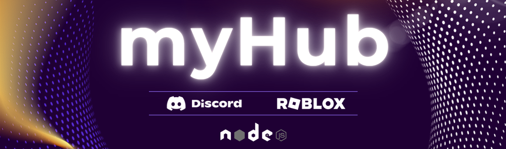

  

  
  
  
  

  
  

---

An advanced Discord bot designed to assist digital stores on Discord by integrating with sales platforms and managing Roblox whitelists. myHub automates customer management, role assignments, and whitelist processes for a seamless experience.

## 🚀 A Discord Whitelist Roblox Bot.

myHub consists of multiple modules, some of which are open source:

- 🔹 **Core Bot**: The main bot logic and command handler.
- 🔹 **Database**: The storage system handling user purchases and whitelist management.
- 🔹 **API Server**: Manages external integrations with sales platforms.
- 🔹 **Whitelist System**: Ensures automatic whitelisting of users after purchase.
